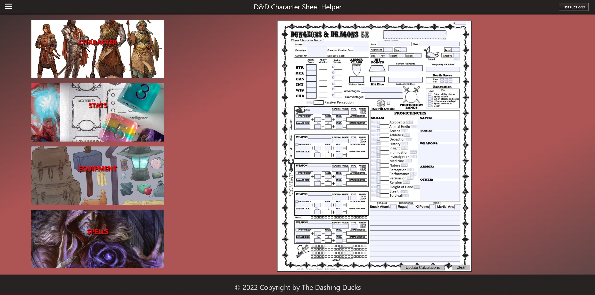

<h1> Dungeons and Dragons Character Creation Tool </h1>

<h2> The one and only tool to create a randomized D&D character for you! </h2>

Have you ever wished to spice up your D&D game with your buddies, but didn't know a simple way to do it? Look no further! We present to you our D&D Character Creation Tool that comes in handy to create a fully randomized character withtin your D&D world.

<h2> What is it? </h2>

A tool that creates a randomized character for you. You can also input specfic details about your character if you want to as well

<h2> What can it do? </h2>

Creates a character which includes:

-   Names
    -   Human
    -   Elven
    -   Orcish
    -   Dwarvish
    
-   Stats
    -   Strength
    -   Dexterity
    -   Constitution
    -   Intelligence
    -   Wisdom
    -   Charisma
    
-   Equipment
    -   Melee Weapons
    -   Ranged Weapons
    -   Shields
    -   Armor
    -   Talismans
    -   And other starting equipment
    
-   Spells
    -   Simulacrum
    -   Arcane Eye
    -   Power Word: Kill
    -   Disintegrate
    -   Summoning a pool of lava beneath that annoying friend

<h2> And Many More! </h2>

<h2> How did we create it? </h2>

We used a multitude of technologies, including:

-   HTML
-   CSS
-   JavaScript
-   Google Materialize
-   jQuery
-   jQuery UI

<h2> The Main Page </h2>

Brought To You By _The Dashing Ducks_:

-   Ryan Dooley
-   Ryan Buckley
-   Meg Martinez
-   Mohammad Shahid
